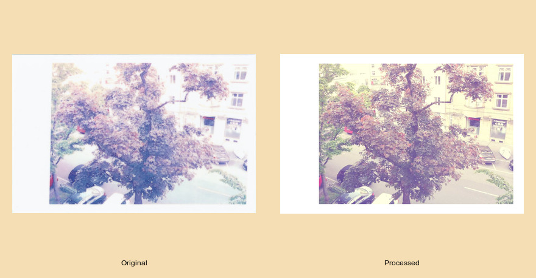

# Polaroid-SNAP script

A simple imageMagick script to apply the same frame as the one obtained when taking a picture with the Polaroid-SNAP.
It also implements the photobooth option, in order to get four pictures in one image with the respective spacings and frames.

## 1. Introduction

The Polaroid SNAP is a great camera to take pictures with your friends and just capture the moment.
The nice retro effect added by the white frame is a nice touch, but it's not keep in the digital version of the picture saved to the SD-Card.
So I thought that it would be nice to have a script to introduce the same effect to the digital version (just for fun).
The script not only adds the distinctive frame but also is capable of simulate the photobooth effect.

None of this is revolutionary in any sense, but it is very practical and I just like to have these digital versions of the printed pictures.

## 1. Installation

You can just clone this repository and use the scripts directly (given execution privileges first, of course).

### Requirements

This script has only been tested under Linux so I am !00% sure that it will not work under Windows.
As for MacOS, I don't know. Maybe it works.

Also, imageMagick has to be installed in the system.

## 2. Usage

### 2.1. Adding the Polaroid frame

This is achieved with the script ``polaroid-snap`` script.
It takes only one argument, the location of the image you want to add the frame to, and it generates a new image in the working directory:

```
$ polaroid-snap image_001.jpeg
```




